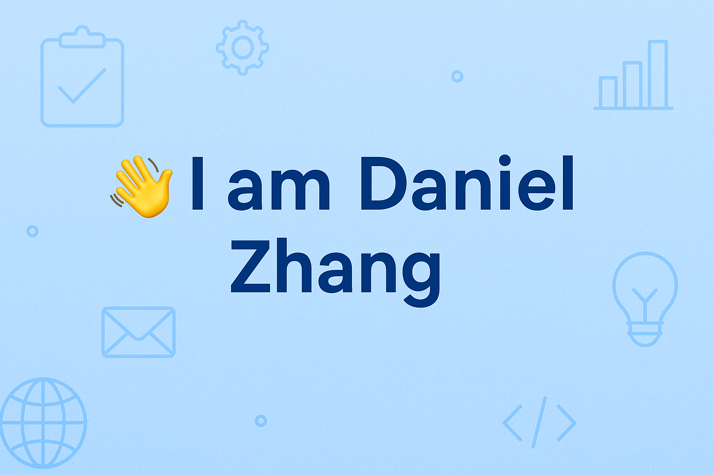

# Hi, I'm Daniel Zhang 👋

I am a Software Developer student at **Manitoba Institute of Trades and Technology (MITT)**, currently building my skills in full-stack web development, object-oriented programming, database design, and software testing.

I enjoy creating clean, responsive applications and turning project requirements into working software. I also have a background in digital art and 3D design, which helps me think about UI, layout, user experience, and visual presentation when building web projects.

---

## About Me

- 🎓 Software Developer student at **MITT**
- 💻 Interested in **web development, API development, UI design, and software architecture**
- 🧠 Practicing **C#, ASP.NET Core, MVC, Entity Framework Core, PHP, JavaScript, SQL, and unit testing**
- 🎨 Background in **digital art, Photoshop, Blender, and 3D asset creation**
- 🎮 Competitive FPS player who enjoys performance optimization, strategy, and problem solving
- 🚀 Always working on improving my coding habits, project structure, and technical communication

---

## Technical Skills

### Programming Languages

### Frameworks & Technologies

### Databases & Tools

### Testing & Development Practices

### Design & Creative Tools

---

## Current Focus

I am currently focusing on:

- Building ASP.NET Core MVC applications
- Creating RESTful Web APIs
- Using Entity Framework Core with SQL Server
- Writing cleaner C# code with object-oriented principles
- Practicing unit testing with xUnit and Moq
- Improving front-end layouts with HTML, CSS, and JavaScript
- Designing better project structure for real-world applications

---

## Projects & Experience

### Web Development
I have worked on web-based projects using **HTML, CSS, JavaScript, PHP, MySQL, ASP.NET Core MVC, and Entity Framework Core**. These projects helped me practice database-driven applications, user interfaces, form handling, CRUD operations, and clean project organization.

### MITT In-House Competition
I participated in an in-house web development competition at MITT, where I used **PHP, HTML, CSS, JavaScript, and MySQL** to build a functional web application under project requirements and time constraints.

### Software Testing
I have experience writing unit tests for C# applications using **xUnit**, including normal cases, boundary cases, edge cases, and service/controller testing with mocked dependencies.

### Creative Background
Before focusing on software development, I worked with tools such as **Blender** and **Adobe Photoshop**. This experience helps me approach software projects with stronger attention to layout, usability, and visual design.

---

## Top Languages

---

## Interests

- Full-stack web development
- UI/UX design
- API development
- Game-related tools and analytics
- Database-driven applications
- Software architecture and design patterns
- Performance optimization in both software and gaming

---

## Connect With Me

- LinkedIn: <a href="https://www.linkedin.com/in/daniel-zhang-9b9aa7226/">Daniel Zhang</a>
- Portfolio: <a href="https://traceless0714.wixsite.com/my-site-1">My Portfolio</a>
- Email: <a href="mailto:traceless0714@gmail.com">traceless0714@gmail.com</a>

---

## Thanks for visiting!

I am always open to learning opportunities, collaboration, internship opportunities, and technical discussions.
